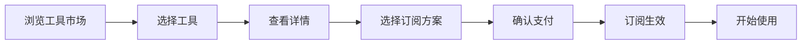
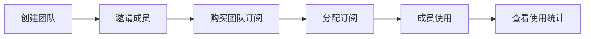

## 1. 产品概述

SaaS订阅工具聚合平台，让用户可以按需订阅各种在线工具（设计、开发、营销等），通过灵活的订阅方案、支付管理和团队协作功能，帮助中小企业和个人开发者降低软件采购成本，同时为平台运营方创造订阅佣金收入。

- 核心价值：一站式订阅管理，灵活按需订阅，降低企业软件采购成本30%-50%
- 目标用户：中小企业、创业团队、个人开发者、自由职业者

---

## 2. 核心功能

### 2.1 用户角色

| 角色 | 注册方式 | 核心权限 |
|------|-----------|----------|
| 个人用户 | 邮箱/手机号注册 | 浏览工具市场、订阅工具、管理个人订阅、查看账单 |
| 团队管理员 | 企业邮箱注册 | 团队成员管理、订阅分配、团队账单管理、权限控制 |
| 平台运营 | 后台管理 | 工具上架管理、佣金结算、数据统计 |

### 2.2 功能模块

1. **首页**：Hero展示、工具分类导航、热门推荐、平台优势、定价方案
2. **工具市场**：工具分类浏览、搜索筛选、工具详情、订阅方案对比
3. **订阅管理**：我的订阅、账单历史、支付方式、续订/取消订阅
4. **团队协作**：成员管理、订阅分配、使用统计、团队账单
5. **个人中心**：账户信息、安全设置、通知偏好

### 2.3 页面详情

| 页面名称 | 模块名称 | 功能描述 |
|---------|---------|----------|
| 首页 | Hero区域 | 平台价值主张、CTA按钮、动态背景效果 |
| 首页 | 工具分类 | 设计/开发/营销/协作四大分类卡片展示 |
| 首页 | 热门推荐 | 精选工具展示，带hover动效 |
| 首页 | 平台优势 | 四大核心优势图标展示 |
| 首页 | 定价方案 | 个人版/团队版/企业版三档定价卡片 |
| 工具市场 | 分类筛选 | 左侧分类导航，支持多维度筛选 |
| 工具市场 | 搜索功能 | 关键词搜索、智能推荐 |
| 工具市场 | 工具列表 | 卡片式布局，显示工具信息和订阅按钮 |
| 工具市场 | 工具详情 | 工具介绍、功能特性、用户评价、订阅选项 |
| 订阅管理 | 我的订阅 | 活跃订阅列表，支持管理操作 |
| 订阅管理 | 账单历史 | 月度账单、发票下载、消费统计图表 |
| 订阅管理 | 支付方式 | 添加/编辑支付方式、自动续费设置 |
| 团队协作 | 成员管理 | 邀请成员、角色分配、移除成员 |
| 团队协作 | 订阅分配 | 将订阅分配给团队成员使用 |
| 团队协作 | 使用统计 | 团队使用情况数据可视化 |
| 个人中心 | 账户信息 | 个人资料编辑、头像上传 |
| 个人中心 | 安全设置 | 密码修改、登录设备管理 |

---

## 3. 核心流程

### 3.1 订阅流程
用户浏览工具市场 → 选择心仪工具 → 查看工具详情 → 选择订阅方案 → 确认支付 → 订阅生效 → 开始使用

### 3.2 团队协作流程
创建团队 → 邀请成员 → 购买团队订阅 → 分配订阅给成员 → 成员使用 → 管理员查看统计

---

## 4. 用户界面设计

### 4.1 设计风格
- **主色调**：深邃藏蓝 (#0A1628) 作为主背景，营造专业商务感
- **强调色**：电光紫 (#7C3AED) 作为品牌主色，搭配霓虹青 (#06B6D4) 作为辅助色
- **渐变**：紫蓝渐变营造科技感，金色 (#F59E0B) 用于突出重要信息
- **按钮风格**：圆角8px，hover时微上浮+阴影增强，带微妙的边框光效
- **字体**：标题使用 Lexend Deca，正文使用 Inter
- **布局风格**：卡片式布局，毛玻璃效果，分层阴影营造层次感
- **图标风格**：线性图标，hover时渐变填充

### 4.2 页面设计概述

| 页面名称 | 模块名称 | UI元素 |
|---------|---------|---------|
| 首页 | Hero区域 | 大标题渐变文字，动态粒子背景，CTA按钮光效，交错动画入场 |
| 首页 | 工具分类 | 卡片悬停上浮，图标渐变动画 |
| 首页 | 热门推荐 | 横向滚动卡片，悬停放大效果 |
| 首页 | 定价方案 | 三列卡片布局，推荐方案高亮边框光效 |
| 工具市场 | 工具列表 | 网格布局卡片，悬停显示快速操作按钮 |
| 工具市场 | 工具详情 | 大图展示，标签系统，特性图标列表 |
| 订阅管理 | 账单图表 | 环形图+柱状图数据可视化 |
| 团队协作 | 成员列表 | 表格卡片混合布局，状态标签 |

### 4.3 响应式
- **桌面优先**：1440px 基准设计，12栅格系统
- **平板适配**：1024px 调整为两列布局
- **移动适配**：768px 单列布局，汉堡菜单
- **触控优化**：移动端按钮尺寸≥48px，滑动手势支持

### 4.4 动效设计
- 页面加载：元素从下往上交错入场，delay 100ms 间隔
- 卡片悬停：translateY(-4px) + 阴影扩散
- 按钮交互：点击时缩放0.98倍，释放回弹
- 导航滚动：导航栏滚动时背景模糊+背景色加深
- 模态框：背景模糊+缩放入场
