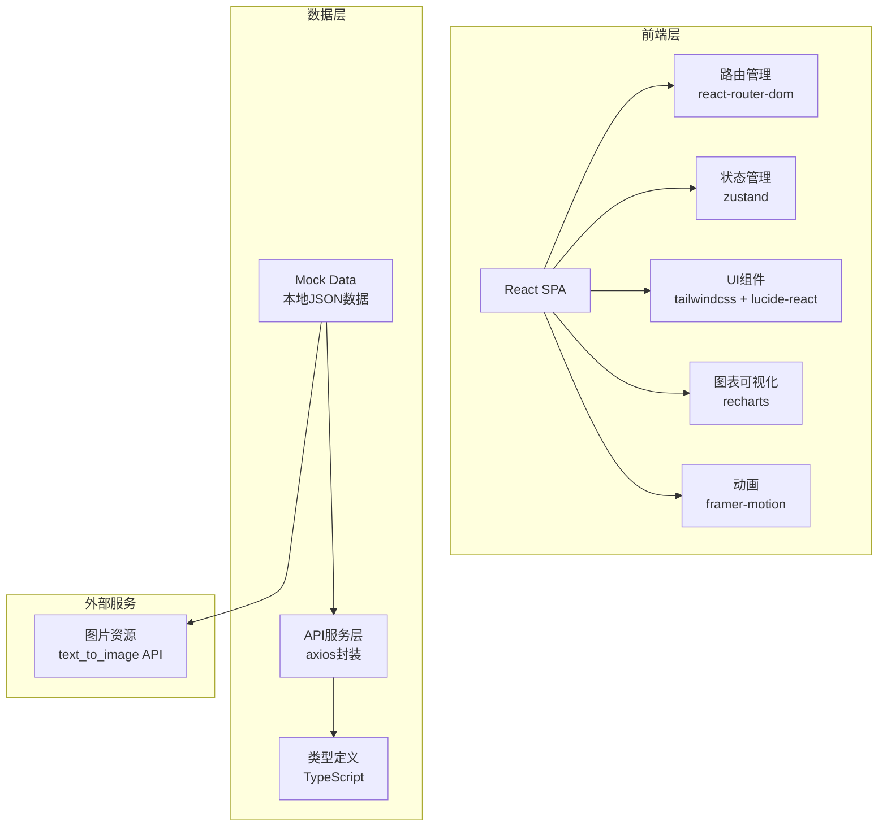
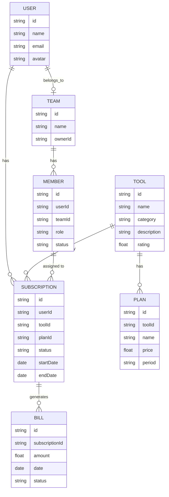

## 1. 架构设计



---

## 2. 技术描述

- **前端框架**：React@18 + TypeScript@5
- **构建工具**：Vite@5
- **样式方案**：Tailwind CSS@3.4
- **路由管理**：react-router-dom@6
- **状态管理**：zustand@4
- **UI图标**：lucide-react@0.344
- **图表库**：recharts@2.12
- **动画库**：framer-motion@11
- **HTTP客户端**：axios@1.6
- **数据来源**：本地Mock数据，模拟真实API响应

---

## 3. 路由定义

| 路由路径 | 页面名称 | 组件路径 |
|---------|---------|----------|
| `/` | 首页 | `pages/Home.tsx` |
| `/market` | 工具市场 | `pages/Market.tsx` |
| `/market/:id` | 工具详情 | `pages/ToolDetail.tsx` |
| `/subscriptions` | 订阅管理 | `pages/Subscriptions.tsx` |
| `/team` | 团队协作 | `pages/Team.tsx` |
| `/profile` | 个人中心 | `pages/Profile.tsx` |
| `/login` | 登录页 | `pages/Login.tsx` |
| `/register` | 注册页 | `pages/Register.tsx` |
| `*` | 404页面 | `pages/NotFound.tsx` |

---

## 4. API 类型定义

```typescript
// 工具类型
interface Tool {
  id: string;
  name: string;
  description: string;
  category: 'design' | 'development' | 'marketing' | 'collaboration';
  logo: string;
  rating: number;
  usersCount: number;
  plans: Plan[];
  features: string[];
  screenshots: string[];
}

// 订阅方案
interface Plan {
  id: string;
  name: string;
  price: number;
  period: 'monthly' | 'yearly';
  features: string[];
  recommended?: boolean;
}

// 用户订阅
interface UserSubscription {
  id: string;
  toolId: string;
  toolName: string;
  toolLogo: string;
  planName: string;
  price: number;
  startDate: string;
  endDate: string;
  status: 'active' | 'expired' | 'cancelled';
  autoRenew: boolean;
}

// 账单
interface Bill {
  id: string;
  date: string;
  amount: number;
  status: 'paid' | 'pending' | 'failed';
  items: BillItem[];
}

interface BillItem {
  name: string;
  quantity: number;
  price: number;
}

// 团队成员
interface TeamMember {
  id: string;
  name: string;
  email: string;
  avatar: string;
  role: 'admin' | 'member';
  joinDate: string;
  status: 'active' | 'pending';
  subscriptions: string[];
}

// 用户信息
interface User {
  id: string;
  name: string;
  email: string;
  avatar: string;
  teamId?: string;
  teamRole?: 'admin' | 'member';
}
```

---

## 5. 数据模型

### 5.1 ER图



### 5.2 Mock数据结构

```typescript
// mock/tools.ts
export const tools: Tool[] = [
  {
    id: '1',
    name: 'Figma',
    category: 'design',
    description: '协作式界面设计工具',
    logo: 'https://...',
    rating: 4.9,
    usersCount: 125000,
    plans: [...],
    features: [...],
    screenshots: [...]
  },
  // ... 更多工具数据
];

// mock/subscriptions.ts
export const userSubscriptions: UserSubscription[] = [
  {
    id: 'sub-1',
    toolId: '1',
    toolName: 'Figma',
    planName: 'Professional',
    price: 45,
    startDate: '2024-01-15',
    endDate: '2025-01-15',
    status: 'active',
    autoRenew: true
  },
  // ... 更多订阅数据
];

// mock/team.ts
export const teamMembers: TeamMember[] = [
  {
    id: 'member-1',
    name: '张三',
    email: 'zhangsan@example.com',
    avatar: 'https://...',
    role: 'admin',
    joinDate: '2024-01-01',
    status: 'active',
    subscriptions: ['Figma', 'GitHub']
  },
  // ... 更多成员数据
];
```
