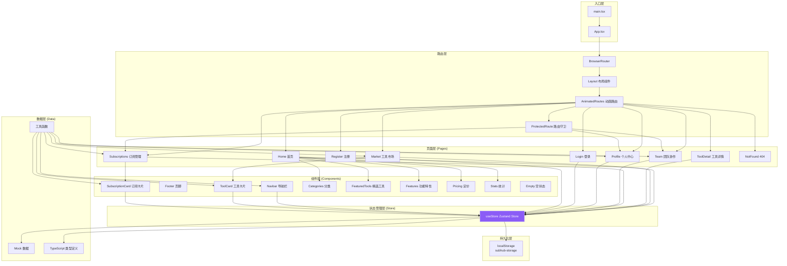
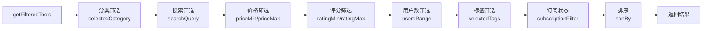
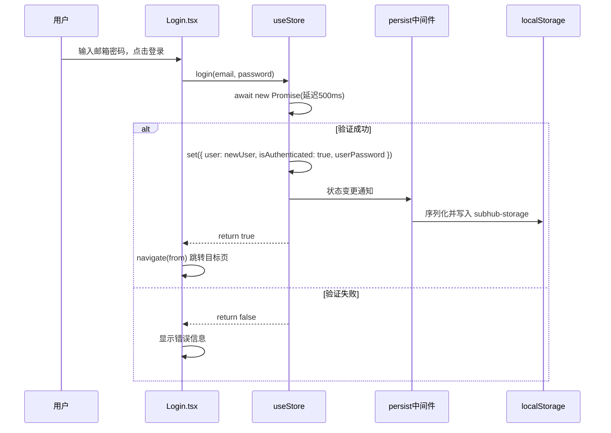
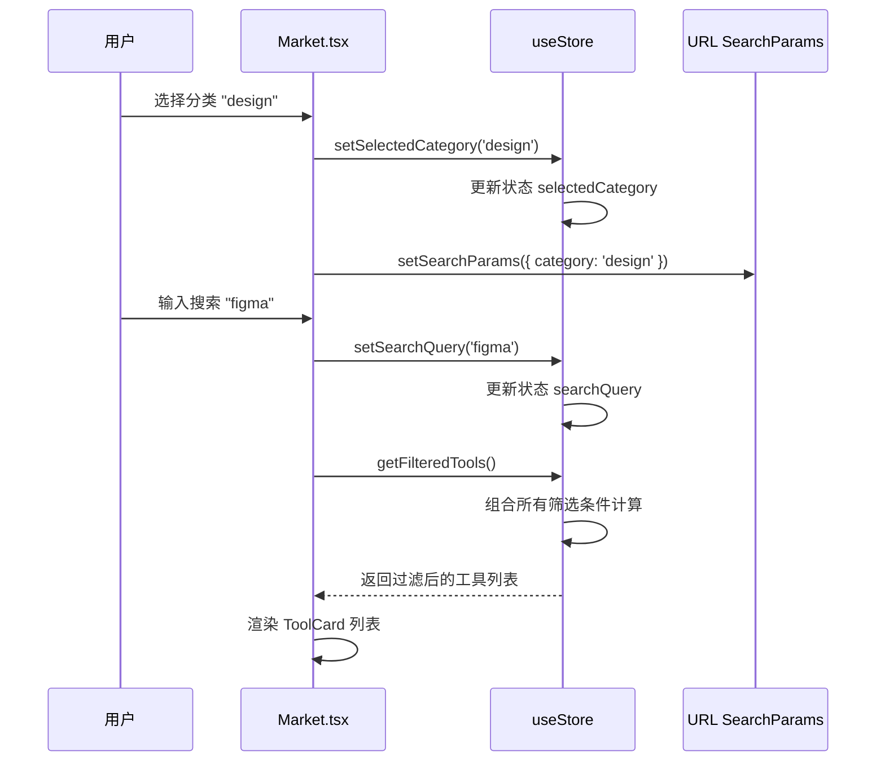

# SubHub 项目架构与状态管理深度解析

## 1. 项目概述

SubHub 是一个基于 React + TypeScript + Vite 构建的 SaaS 工具订阅管理平台，提供工具市场浏览、订阅管理、团队协作、个人中心等核心功能。

### 1.1 技术栈

| 分类 | 技术 | 版本 | 用途 |
|------|------|------|------|
| 前端框架 | React | 18.3.1 | UI 构建 |
| 语言 | TypeScript | 5.8.3 | 类型安全 |
| 构建工具 | Vite | 6.3.5 | 开发构建 |
| 状态管理 | Zustand | 5.0.3 | 全局状态管理 |
| 路由 | React Router DOM | 7.3.0 | 客户端路由 |
| 样式 | Tailwind CSS | 3.4.17 | CSS 框架 |
| UI 图标 | Lucide React | 0.511.0 | 图标库 |
| 动画 | Framer Motion | 11.18.2 | 动效实现 |
| 图表 | Recharts | 2.15.1 | 数据可视化 |
| HTTP | Axios | 1.7.9 | HTTP 客户端 |

---

## 2. 项目整体架构图



---

## 3. 目录结构详解

```
src/
├── assets/                 # 静态资源
│   └── react.svg
├── components/             # 公共组件
│   ├── home/              # 首页专用组件
│   │   ├── Categories.tsx
│   │   ├── FeaturedTools.tsx
│   │   ├── Features.tsx
│   │   ├── Hero.tsx
│   │   ├── Pricing.tsx
│   │   └── Stats.tsx
│   ├── Empty.tsx
│   ├── Footer.tsx
│   ├── Navbar.tsx
│   ├── ProtectedRoute.tsx
│   ├── SubscriptionCard.tsx
│   └── ToolCard.tsx
├── hooks/                 # 自定义 Hooks
│   └── useTheme.ts
├── lib/                   # 工具库
│   └── utils.ts           # cn 类名合并等工具
├── mock/                  # Mock 数据
│   ├── subscriptions.ts
│   ├── team.ts
│   ├── tools.ts
│   └── user.ts
├── pages/                 # 页面组件
│   ├── Home.tsx
│   ├── Login.tsx
│   ├── Market.tsx
│   ├── NotFound.tsx
│   ├── Profile.tsx
│   ├── Register.tsx
│   ├── Subscriptions.tsx
│   ├── Team.tsx
│   └── ToolDetail.tsx
├── store/                 # 状态管理
│   └── useStore.ts        # Zustand Store
├── types/                 # TypeScript 类型定义
│   └── index.ts
├── App.tsx                # 应用根组件
├── index.css              # 全局样式
├── main.tsx               # 应用入口
└── vite-env.d.ts          # Vite 类型声明
```

---

## 4. Zustand 状态管理架构深度解析

### 4.1 状态管理架构图

```mermaid
flowchart TB
    subgraph "Zustand Store 核心"
        direction TB
        Store[useStore<br/>create<Store>()]
        
        subgraph "中间件层"
            Persist[persist 中间件]
            Storage[createJSONStorage]
        end
        
        subgraph "状态域 (State Slices)"
            direction TB
            Auth[认证状态域]
            Market[市场筛选状态域]
            Subscription[订阅状态域]
            Team[团队状态域]
            Settings[设置状态域]
            Data[业务数据域]
        end
        
        subgraph "Action 操作"
            direction TB
            AuthActions[认证操作<br/>login/register/logout]
            FilterActions[筛选操作<br/>setCategory/setSearch/sortBy]
            SubActions[订阅操作<br/>add/cancel/renew/downloadInvoice]
            TeamActions[团队操作<br/>invite/remove/changeRole]
            ProfileActions[个人操作<br/>updateProfile/changePassword]
            DerivedActions[派生操作<br/>getFilteredTools/getAllTags]
        end
    end

    subgraph "消费层 (Components)"
        direction TB
        Navbar[Navbar.tsx<br/>user, isAuthenticated, logout]
        Market[Market.tsx<br/>筛选状态 + getFilteredTools]
        Subscriptions[Subscriptions.tsx<br/>subscriptions, downloadInvoice]
        Team[Team.tsx<br/>teamMembers, invite/remove]
        Profile[Profile.tsx<br/>user, notificationSettings]
        Login[Login.tsx<br/>login, isAuthenticated]
        ProtectedRoute[ProtectedRoute.tsx<br/>isAuthenticated]
        SubCard[SubscriptionCard.tsx<br/>cancel/renew/toggleAutoRenew]
    end

    subgraph "持久化层"
        LocalStorage[(localStorage<br/>subhub-storage)]
    end

    Store --> Persist
    Persist --> Storage
    Storage --> LocalStorage
    
    Store --> Auth & Market & Subscription & Team & Settings & Data
    Store --> AuthActions & FilterActions & SubActions & TeamActions & ProfileActions & DerivedActions
    
    Navbar & Market & Subscriptions & Team & Profile & Login & ProtectedRoute & SubCard --> Store
    
    Persist -- "partialize 选择性持久化" --> LocalStorage

    style Store fill:#8b5cf6,stroke:#a78bfa,stroke-width:2px,color:#fff
    style Persist fill:#06b6d4,stroke:#22d3ee,stroke-width:2px,color:#fff
```

---

### 4.2 Store 完整接口定义

核心 Store 定义在 [useStore.ts](file:///Users/tog/Desktop/code/solo/xyj-115/src/store/useStore.ts#L24-L74)：

```typescript
interface Store {
  // ========== 业务数据 ==========
  user: User | null;                          // 当前用户
  subscriptions: UserSubscription[];          // 用户订阅列表
  tools: Tool[];                              // 工具列表
  teamMembers: TeamMember[];                  // 团队成员列表
  teamSettings: TeamSettings;                 // 团队设置
  
  // ========== 市场筛选状态 ==========
  selectedCategory: Category | 'all';         // 选中分类
  searchQuery: string;                        // 搜索关键词
  sortBy: SortOption;                         // 排序方式
  priceMin: number;                           // 价格下限
  priceMax: number;                           // 价格上限
  ratingMin: number;                          // 评分下限
  ratingMax: number;                          // 评分上限
  usersRange: UsersRange;                     // 用户数量范围
  selectedTags: string[];                     // 选中标签
  subscriptionFilter: SubscriptionFilter;     // 订阅状态筛选
  
  // ========== 认证状态 ==========
  isAuthenticated: boolean;                   // 是否认证
  userPassword: string;                       // 用户密码（仅内存）
  
  // ========== 设置状态 ==========
  notificationSettings: NotificationSettings; // 通知设置
  
  // ========== Action 方法 ==========
  // 基础 setters
  setUser, setSelectedCategory, setSearchQuery, setSortBy,
  setPriceRange, setRatingRange, setUsersRange, setSelectedTags,
  toggleTag, setSubscriptionFilter,
  
  // 认证操作
  login, register, logout,
  
  // 个人资料操作
  updateUserProfile, changePassword, updateNotificationSettings,
  
  // 订阅操作
  addSubscription, cancelSubscription, renewSubscription,
  toggleAutoRenew, downloadInvoice,
  
  // 派生数据计算
  getFilteredTools, clearAllFilters, getAllTags, getPriceRange,
  
  // 团队操作
  inviteMember, removeMember, changeMemberRole, updateTeamSettings,
  
  // 重置操作
  resetToDefaults
}
```

---

### 4.3 状态域划分详解

#### 4.3.1 认证状态域 (Auth State)

```typescript
// 状态
user: User | null;
isAuthenticated: boolean;
userPassword: string;

// Actions
login: (email: string, password: string) => Promise<boolean>
register: (name: string, email: string, password: string) => Promise<boolean>
logout: () => void
```

**设计特点：**
- 使用 `async/await` 模拟网络请求延迟
- 支持用户自动创建（首次登录自动注册）
- 密码仅存储在内存和 `localStorage`（演示用途，生产环境需加密）

**消费组件：**
- [Login.tsx](file:///Users/tog/Desktop/code/solo/xyj-115/src/pages/Login.tsx) - 登录页面
- [Navbar.tsx](file:///Users/tog/Desktop/code/solo/xyj-115/src/components/Navbar.tsx) - 导航栏用户菜单
- [ProtectedRoute.tsx](file:///Users/tog/Desktop/code/solo/xyj-115/src/components/ProtectedRoute.tsx) - 路由守卫

---

#### 4.3.2 市场筛选状态域 (Market Filter State)

```typescript
// 状态（10个筛选维度）
selectedCategory: Category | 'all'      // 分类筛选
searchQuery: string                     // 搜索关键词
sortBy: SortOption                      // 7种排序方式
priceMin / priceMax: number             // 价格区间
ratingMin / ratingMax: number           // 评分区间
usersRange: UsersRange                  // 用户数量范围（5档）
selectedTags: string[]                  // 标签多选
subscriptionFilter: SubscriptionFilter  // 订阅状态（4档）

// Actions
setSelectedCategory, setSearchQuery, setSortBy,
setPriceRange, setRatingRange, setUsersRange,
setSelectedTags, toggleTag, setSubscriptionFilter,
clearAllFilters,

// 派生计算
getFilteredTools: () => Tool[]          // 组合所有筛选+排序逻辑
getAllTags: () => string[]              // 获取所有标签
getPriceRange: () => { min: number; max: number }
```

**设计特点：**
- **单一数据源原则**：所有筛选状态集中管理，避免组件间状态重复
- **派生计算**：`getFilteredTools()` 组合所有筛选条件，返回最终结果
- **URL 同步**：在 [Market.tsx](file:///Users/tog/Desktop/code/solo/xyj-115/src/pages/Market.tsx#L77-L82) 中通过 `useSearchParams` 与 URL 参数同步

**筛选逻辑流程图：**


---

#### 4.3.3 订阅状态域 (Subscription State)

```typescript
// 状态
subscriptions: UserSubscription[]

// Actions
addSubscription: (subscription: UserSubscription) => void
cancelSubscription: (id: string) => void
renewSubscription: (id: string) => void
toggleAutoRenew: (id: string) => void
downloadInvoice: (id: string) => void
```

**设计特点：**
- 不可变更新：所有操作使用 `map`/`filter` 返回新数组
- `downloadInvoice` 直接操作 DOM 生成并下载发票文件
- 订阅状态流转：`active` ↔ `cancelled` / `expired`

**消费组件：**
- [Subscriptions.tsx](file:///Users/tog/Desktop/code/solo/xyj-115/src/pages/Subscriptions.tsx) - 订阅管理页面
- [SubscriptionCard.tsx](file:///Users/tog/Desktop/code/solo/xyj-115/src/components/SubscriptionCard.tsx) - 订阅卡片组件

---

#### 4.3.4 团队状态域 (Team State)

```typescript
// 状态
teamMembers: TeamMember[]
teamSettings: TeamSettings

// Actions
inviteMember: (email: string, role: TeamRole) => Promise<boolean>
removeMember: (id: string) => void
changeMemberRole: (id: string, role: TeamRole) => void
updateTeamSettings: (settings: Partial<TeamSettings>) => void
```

**消费组件：**
- [Team.tsx](file:///Users/tog/Desktop/code/solo/xyj-115/src/pages/Team.tsx) - 团队协作页面

---

#### 4.3.5 设置状态域 (Settings State)

```typescript
// 状态
notificationSettings: NotificationSettings {
  emailNotifications: boolean
  pushNotifications: boolean
  subscriptionReminders: boolean
  marketingEmails: boolean
  securityAlerts: boolean
}

// Actions
updateNotificationSettings: (settings: Partial<NotificationSettings>) => void
updateUserProfile: (updates: Partial<User>) => void
changePassword: (oldPassword: string, newPassword: string) => Promise<boolean>
```

**消费组件：**
- [Profile.tsx](file:///Users/tog/Desktop/code/solo/xyj-115/src/pages/Profile.tsx) - 个人中心页面

---

### 4.4 持久化配置 (Persist Middleware)

Zustand `persist` 中间件配置在 [useStore.ts](file:///Users/tog/Desktop/code/solo/xyj-115/src/store/useStore.ts#L427-L439)：

```typescript
persist(
  (set, get) => ({ /* state & actions */ }),
  {
    name: 'subhub-storage',                    // localStorage 键名
    storage: createJSONStorage(() => localStorage),
    
    // 选择性持久化 - 只持久化必要状态
    partialize: (state) => ({
      user: state.user,                        // 用户信息
      subscriptions: state.subscriptions,      // 订阅列表
      teamMembers: state.teamMembers,          // 团队成员
      teamSettings: state.teamSettings,        // 团队设置
      isAuthenticated: state.isAuthenticated,  // 认证状态
      notificationSettings: state.notificationSettings, // 通知设置
      userPassword: state.userPassword,        // 用户密码
      // 注意：筛选状态（selectedCategory, searchQuery 等）不持久化
    }),
  }
)
```

**持久化策略设计考量：**

| 状态 | 是否持久化 | 原因 |
|------|-----------|------|
| `user`, `isAuthenticated` | ✅ 是 | 刷新页面保持登录状态 |
| `subscriptions` | ✅ 是 | 用户订阅数据需保留 |
| `teamMembers`, `teamSettings` | ✅ 是 | 团队数据需保留 |
| `notificationSettings` | ✅ 是 | 用户偏好设置 |
| `selectedCategory`, `searchQuery` 等筛选状态 | ❌ 否 | 每次进入市场页重置为默认，符合用户预期 |
| `tools` 工具列表 | ❌ 否 | 从 mock 数据加载，无需持久化 |

---

### 4.5 状态选择器使用模式

#### 4.5.1 基础解构模式（最常用）

```typescript
// 在 Market.tsx 中
const {
  getFilteredTools,
  selectedCategory,
  searchQuery,
  sortBy,
  setSelectedCategory,
  setSearchQuery,
  // ... 按需选择
} = useStore();
```

#### 4.5.2 精细选择模式（性能优化）

```typescript
// 只选择需要的状态，避免不必要的重渲染
const user = useStore(state => state.user);
const isAuthenticated = useStore(state => state.isAuthenticated);
const logout = useStore(state => state.logout);
```

#### 4.5.3 多个选择器模式

```typescript
// 使用 shallow 比较避免不必要重渲染
import { shallow } from 'zustand/shallow';

const [subscriptions, downloadInvoice] = useStore(
  state => [state.subscriptions, state.downloadInvoice],
  shallow
);
```

---

### 4.6 数据流示例

#### 4.6.1 用户登录数据流



#### 4.6.2 工具市场筛选数据流



---

## 5. 路由架构

路由定义在 [App.tsx](file:///Users/tog/Desktop/code/solo/xyj-115/src/App.tsx)：

```mermaid
flowchart LR
    Root[BrowserRouter] --> Layout[Layout 组件]
    Layout -->|判断路由| ShowNav{显示导航/页脚?}
    
    ShowNav -->|否| NoLayout[无布局路由]
    ShowNav -->|是| WithLayout[有布局路由]
    
    NoLayout --> Login[/login]
    NoLayout --> Register[/register]
    
    WithLayout --> Navbar[Navbar 导航栏]
    WithLayout --> AnimatedRoutes[动画路由]
    WithLayout --> Footer[Footer 页脚]
    
    AnimatedRoutes --> Home[/]
    AnimatedRoutes --> Market[/market]
    AnimatedRoutes --> ToolDetail[/tool/:id]
    
    AnimatedRoutes --> ProtectedRoute[路由守卫]
    ProtectedRoute -->|isAuthenticated=true| Subscriptions[/subscriptions]
    ProtectedRoute -->|isAuthenticated=true| Team[/team]
    ProtectedRoute -->|isAuthenticated=true| Profile[/profile]
    ProtectedRoute -->|isAuthenticated=false| RedirectLogin[重定向 /login]
    
    AnimatedRoutes --> NotFound[* 404]
```

---

## 6. 核心设计模式与最佳实践

### 6.1 Zustand 使用最佳实践

1. **单一 Store 模式**：整个应用使用一个 Store，通过状态域划分逻辑
2. **不可变更新**：所有状态更新返回新对象/数组
3. **选择性持久化**：使用 `partialize` 只持久化必要状态
4. **Action 内聚**：相关操作放在一起，如 `getFilteredTools` 内部完成所有筛选逻辑
5. **派生计算**：复杂筛选逻辑封装在 Store 内部，组件只管调用

### 6.2 状态管理架构优点

| 优点 | 说明 |
|------|------|
| **集中管理** | 所有状态在一个 Store，易于调试和理解 |
| **类型安全** | TypeScript 完整类型覆盖 |
| **性能优异** | Zustand 极简实现，无 Provider 嵌套 |
| **避免 Props Drilling** | 深层组件直接访问状态 |
| **持久化开箱即用** | persist 中间件处理序列化 |
| **可预测** | 所有状态变更通过 Action，数据流清晰 |

### 6.3 可优化点

1. **按领域拆分 Store**：当前单 Store 可拆分为 `useAuthStore`、`useMarketStore`、`useSubscriptionStore` 等
2. **引入 Immer**：简化不可变更新语法
3. **状态选择器优化**：复杂组件使用 `shallow` 比较减少重渲染
4. **DevTools 集成**：启用 Zustand DevTools 方便调试
5. **密码安全**：生产环境不应在 localStorage 存储明文密码

---

## 7. 关键文件索引

| 文件 | 说明 | 核心内容 |
|------|------|----------|
| [useStore.ts](file:///Users/tog/Desktop/code/solo/xyj-115/src/store/useStore.ts) | Zustand Store 核心 | 状态定义、Actions、持久化配置 |
| [App.tsx](file:///Users/tog/Desktop/code/solo/xyj-115/src/App.tsx) | 应用根组件 | 路由配置、布局管理、动画过渡 |
| [index.ts](file:///Users/tog/Desktop/code/solo/xyj-115/src/types/index.ts) | 类型定义 | 所有 TypeScript 接口和类型 |
| [Market.tsx](file:///Users/tog/Desktop/code/solo/xyj-115/src/pages/Market.tsx) | 工具市场 | 10维度筛选 + 排序 + 搜索 |
| [Subscriptions.tsx](file:///Users/tog/Desktop/code/solo/xyj-115/src/pages/Subscriptions.tsx) | 订阅管理 | 订阅CRUD、账单、图表 |
| [Navbar.tsx](file:///Users/tog/Desktop/code/solo/xyj-115/src/components/Navbar.tsx) | 导航栏 | 认证状态消费、用户菜单 |
| [ProtectedRoute.tsx](file:///Users/tog/Desktop/code/solo/xyj-115/src/components/ProtectedRoute.tsx) | 路由守卫 | 认证检查与重定向 |
